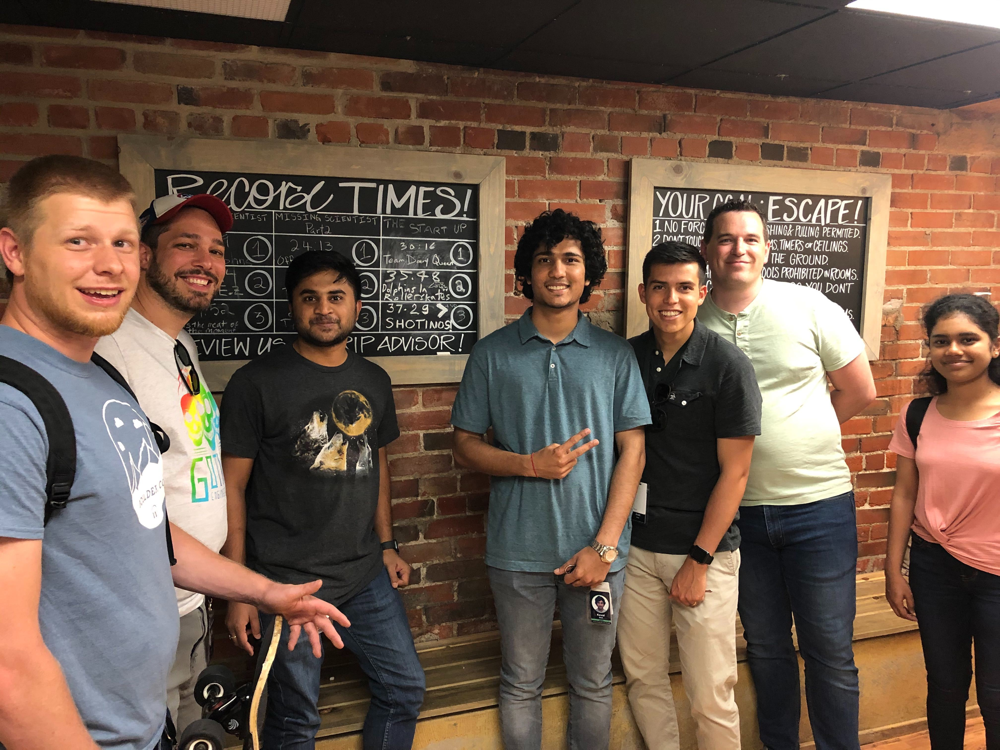

Software Engineer Intern
Splunk Inc, Boulder, CO

June 2019 – Present

Software development work in areas of Data Engineering, Data Analytics, and Event correlations across silos to build best-in-class business analytics software.

Team Splunk Boulder setting fastest escape time record at Enigma Escape Rooms.

Systems Perfomance and Analysis Intern
RoboCop.io, India

May 2016 – July 2016

• Create plugins in Python for system monitoring tools such as collectd, Bosun.
• Synchronize security checks with CVE and NVD databases to set up alerts and checks for registered system vulnerabilities.
• Extensive use of python and corresponding libraries to implement the above mentioned.
